<div align="center">




<a href="https://www.linkedin.com/in/amir-iliyas-ahmad/">
  
</a>


</div>

## <samp>❯ cat about.md</samp>

```ts
const amir = {
  role:       "Full Stack Developer",
  base:       "United Arab Emirates",
  building:   ["performant full-stack apps", "Next.js", "TypeScript"],
  learning:   ["advanced unit testing with Jest", "serverless architecture"],
  wants:      "AWS / GCP infrastructure + CI/CD mastery",
  openTo:     ["open source", "React Native", "scalable backends"],
  askMeAbout: ["React", "Redux & React Query", "UI/UX workflows in Figma"],
  motto:      "Design in Figma, ship in production.",
};
```

> **Fun fact —** I like closing the gap between design and code: high-fidelity Dribbble
> inspiration goes in, working components come out.

<div align="center"></div>

## <samp>❯ ls ~/stack</samp>

<div align="center">

**Core**


**State, Data & Forms**


**Styling & Design**


**Data, Cloud & Ops**


</div>

## <samp>❯ git log --stat</samp>

<div align="center">





</div>

<details>
<summary><samp>❯ gh graph --year 2025</samp></summary>
<br/>

</details>

<details>
<summary><samp>❯ gh graph --year 2024</samp></summary>
<br/>

</details>

<details>
<summary><samp>❯ gh graph --year 2023</samp></summary>
<br/>

</details>

## <samp>❯ ./snake --run</samp>

<div align="center">


## <samp>❯ contact --connect</samp>

<a href="https://amir-ibn-iliyas.github.io/portfolio/">
  
</a>
<a href="https://www.linkedin.com/in/amir-iliyas-ahmad/">
  
</a>

<br/><br/>

<sub><b>Built with purpose. Shipped with tawakkul.</b></sub>

</div>
